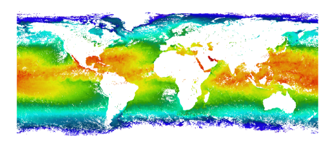
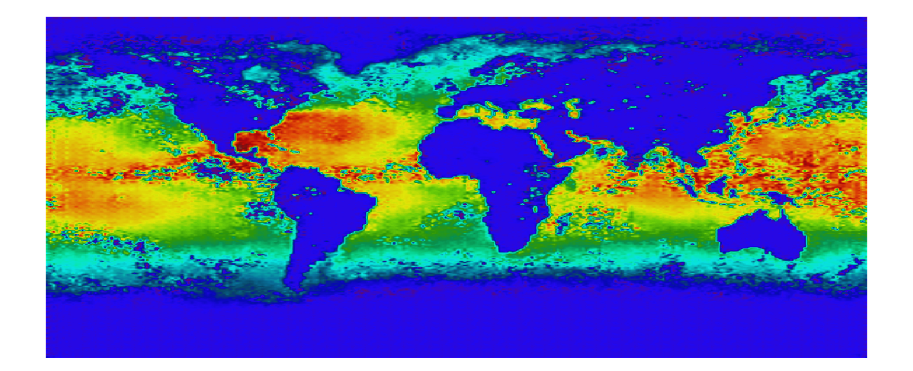

# SST Pix2Pix GAN 

This project implements a Pix2Pix GAN to reconstruct missing Sea Surface Temperature (SST) data using satellite observations. It includes enhanced handling of land-sea boundaries and coastal gradients for more realistic predictions.

## Overview

- **Architecture**: U-Net Generator + PatchGAN Discriminator
- **Key Features**:
  - Coastal gradient loss
  - Land mask penalty
  - Boundary continuity regularization
- **Data**: NetCDF SST data from satellite observations  
  Dataset: i have uploaded on kaggle (https://www.kaggle.com/datasets/ambaliyagati/sst-8days-aqua-moids-data) 

## Example

| Input SST | Predicted SST |
|-----------|---------------|
|  |  |

## How to Use

1. **Install requirements** (run in Colab):
   ```bash
   pip install torch torchvision xarray netCDF4 scipy
   ```

2. **Train the model**:
   ```bash
   python sst_gan.py --mode train --epochs 100
   ```

3. **Generate missing SST data**:
   ```bash
   python sst_gan.py --mode generate --model_path checkpoints/sst_gan_best.pth
   ```

4. **Visualization**:
   Use the `visualize_results()` and `analyze_coastal_regions()` functions in the script.

## Directory Structure

```
.
├── sst_gan.py
├── input.png
├── output.png
├── training_log.csv
└── checkpoints/
```

## License

MIT License
